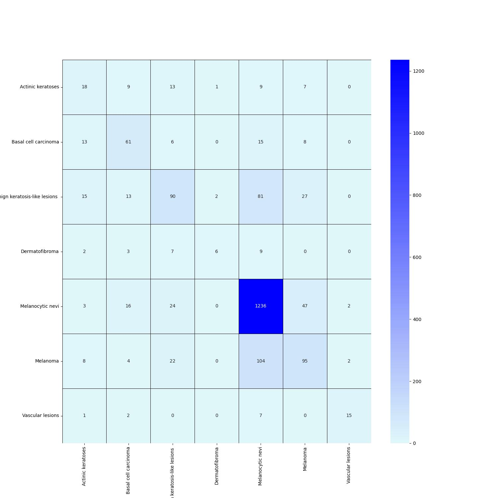

# ResNet from Scratch [WIP] 

This project implements the ResNet architecture from scratch using PyTorch.

## Features
- **Customizable ResNet Architecture**: Adjust expansion/dilation factors and feature map sizes.
- **Pre-trained Models**: Models available in the `models` folder.
- Live app: https://skinlesiondetection.streamlit.app/

## To-Do
- [x] Retrain models in the `models` folder on longer epochs.
- [x] Deploy the model using Streamlit.
- [x] Test the deployed model on new images.

## Getting Started
Clone the repository and follow the setup instructions.

```bash
git clone https://github.com/NichitaCP/ResNet_from_scratch
cd ResNet_from_scratch
```

## Accuracy and Confusion Matrix 
**Top-1 Accuracy: 76.12%  
Top-3 Accuracy: 96.19%**

## Confusion Matrix 


## Train and Validation result plots


## License 
This project is licensed under the Apache License 2.0. You may use, distribute, and modify this software under the terms of the Apache License. You must include a copy of the license in any significant portions of the software and provide a notice of all changes made.
For more information, see the [LICENSE](LICENSE) file in this repository.
